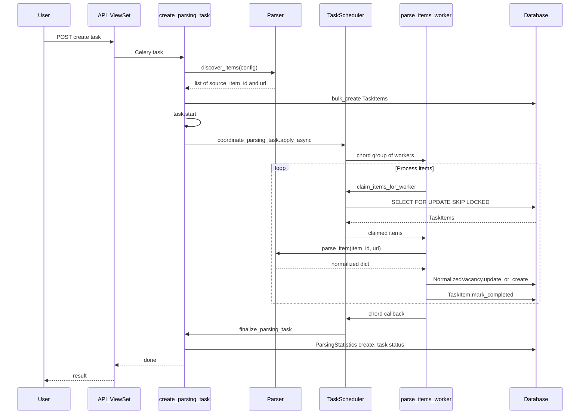
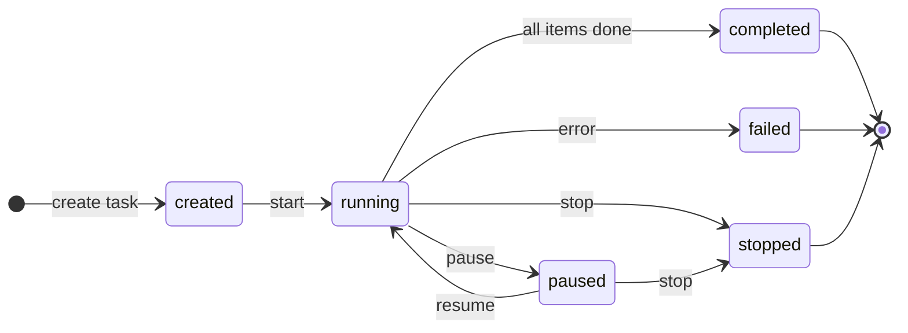
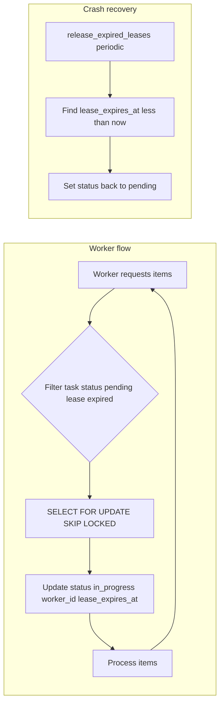
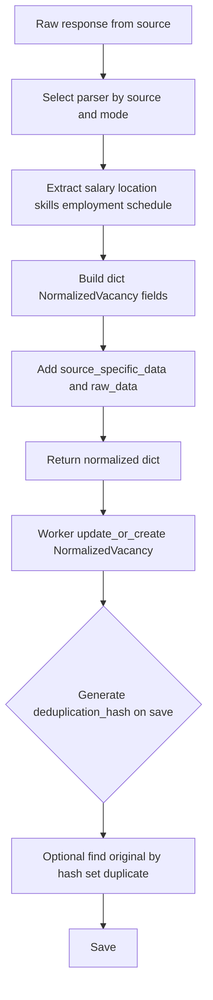
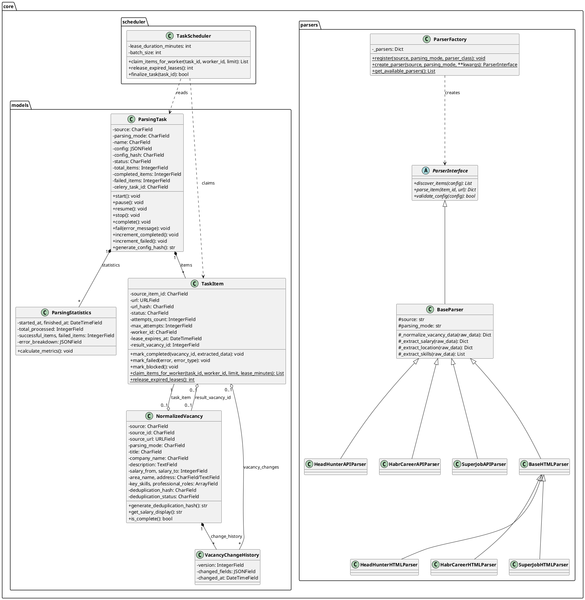

# Документация модуля vacancies_parser

Описание модуля, логика алгоритма парсинга, нормализованный вид данных и схемы процессов. Детальная архитектура и структура каталогов — в [README.md](README.md).

---

## 1. Описание модуля

**Назначение:** автоматизированный парсинг вакансий с нескольких площадок трудоустройства с приведением данных к единому формату (нормализация), дедупликацией и историей изменений.

**Источники:**

| Источник      | Режим API | Режим HTML |
|---------------|-----------|------------|
| HeadHunter    | да        | да         |
| Habr Career   | —         | да         |
| SuperJob      | —         | да         |

**Режимы парсинга:** `api` (официальные/неофициальные API), `html` (парсинг страниц).

**Ключевые возможности:**

- **Discovery** — обнаружение списка вакансий по конфигурации (поиск, регион, страницы).
- **Параллельная обработка** — Celery workers, распределение через claiming.
- **Claiming и lease** — конкурентно-безопасный захват элементов, освобождение при падении worker'а.
- **Нормализация** — единая модель `NormalizedVacancy` для всех источников.
- **Дедупликация** — хэш по ключевым полям, статусы original/duplicate.
- **История изменений** — VacancyChangeHistory, версионность.
- **Управление задачами** — pause, resume, stop.

Подробная архитектура, слои и структура каталогов описаны в [README.md](README.md).

---

## 2. Логика алгоритма парсинга

Алгоритм состоит из двух основных этапов: **discovery** (обнаружение элементов) и **обработка** (парсинг и сохранение в нормализованном виде).

### 2.1. Discovery (обнаружение элементов)

**Вход:** созданная задача `ParsingTask` с полями `source`, `parsing_mode`, `config`.

**Шаги:**

1. Валидация конфигурации: `parser.validate_config(config)` (обязательные поля и типы зависят от источника и режима).
2. Создание парсера: `ParserFactory.create_parser(source, parsing_mode)`.
3. Вызов `parser.discover_items(config)`:
   - **API (HeadHunter):** запросы к `GET /vacancies` с параметрами area, pages, per_page, text, professional_role и т.д.; по ответу собираются `id` и `alternate_url` каждой вакансии.
   - **HTML:** обход страниц поиска (построение URL из config), парсинг списка вакансий и сбор ссылок на карточки.
4. Результат discovery — список элементов: `[{"source_item_id": "...", "url": "..."}]`.
5. Создание записей `TaskItem` для каждого элемента (`bulk_create`, batch 500), обновление `task.total_items`.
6. Переход задачи в статус `running`: `task.start()`.
7. Асинхронный запуск координатора: `coordinate_parsing_task.apply_async(args=[task.id])`.

При ошибке на этапе discovery задача переводится в статус `failed`, ошибка логируется.

### 2.2. Обработка (worker)

**Вход:** задача в статусе `running`, созданные `TaskItem` в статусе `pending`.

**Шаги:**

1. Координатор `coordinate_parsing_task` запускает группу worker'ов через Celery chord (например, 10 worker'ов).
2. Каждый worker в цикле:
   - **Claiming:** вызов `claim_items_for_worker(task_id, worker_id, limit=10)`. Внутри: выборка `TaskItem` по условию (task, status=pending, lease_expires_at &lt; now) с `SELECT FOR UPDATE SKIP LOCKED`, установка status=in_progress, worker_id, lease_expires_at (например, +5 мин).
   - Для каждого полученного item:
     - Вызов `parser.parse_item(item.source_item_id, item.url)`:
       - Запрос к источнику (API или HTML страница).
       - Получение сырых данных.
       - Нормализация: внутри парсера вызывается `_normalize_vacancy_data(raw_data)` и при необходимости `_extract_salary`, `_extract_location`, `_extract_skills`, `_extract_employment`, `_extract_schedule` и т.д. Результат — один словарь с полями в формате NormalizedVacancy.
     - Сохранение: `NormalizedVacancy.objects.update_or_create(source=task.source, source_id=item.source_item_id, defaults=...)` (в defaults передаётся словарь без полей lookup source/source_id, добавляется task_item).
     - При успехе: `item.mark_completed(result_vacancy_id=..., extracted_data=...)`, увеличение счётчика completed у задачи.
     - При ошибке: классификация через error_handler (blocked / network / validation / unknown), вызов `item.mark_failed` или `item.mark_blocked`, увеличение счётчика failed у задачи.
   - Задержка между items при необходимости (из `task.config.get('delay', 0.5)`).
   - Повтор цикла, пока есть доступные items или задача не перестала быть running.
3. После завершения всех worker'ов chord вызывает **финализацию** `finalize_parsing_task`: создание ParsingStatistics, обновление статуса задачи (completed/failed).

**Обработка ошибок:**

- **BlockedError** (403, капча, rate limit): item помечается blocked.
- **NetworkError**: item помечается failed с типом network, учитывается attempts_count и max_attempts.
- **ValidationError**: item помечается failed с типом validation.
- Повторная обработка «зависших» items: периодическая задача `release_expired_leases` сбрасывает items с истёкшим lease обратно в pending.

---

## 3. Нормализованный вид (схема вывода)

Результат парсинга сохраняется в модели **NormalizedVacancy** (таблица `vpm_vacancy`). Ниже — поля модели и маппинг из источников.

### 3.1. Таблица полей NormalizedVacancy

| Поле | Тип | Описание |
|------|-----|----------|
| source | CharField | Источник: headhunter, habr_career, superjob |
| source_id | CharField | ID вакансии на источнике |
| source_url | URLField | URL вакансии на источнике |
| parsing_mode | CharField | api или html |
| task_item | FK TaskItem | Связь с элементом задачи парсинга |
| title | CharField | Название вакансии |
| company_name | CharField | Название компании |
| company_url | URLField | URL компании (опционально) |
| description | TextField | Описание вакансии |
| salary_from, salary_to | IntegerField | Зарплата от/до |
| salary_currency | CharField | RUR, USD, EUR и др. |
| salary_gross | BooleanField | До вычета налогов |
| area_name | CharField | Город/регион |
| area_id | CharField | ID города на источнике |
| address | TextField | Адрес |
| experience | CharField | Требуемый опыт (noExperience, between1And3 и др.) |
| employment_type | ArrayField | Типы занятости (full, part, project и др.) |
| schedule | ArrayField | Графики (fullDay, remote, flexible и др.) |
| key_skills | ArrayField | Ключевые навыки |
| professional_roles | ArrayField | Профессиональные роли |
| contacts | JSONField | Контакты (name, email, phones) |
| is_active, archived | BooleanField | Статус вакансии |
| published_at | DateTimeField | Дата публикации на источнике |
| has_test, accepts_handicapped, response_letter_required | BooleanField | Доп. признаки |
| source_specific_data | JSONField | Поля, уникальные для источника |
| raw_data | JSONField | Сырой ответ для отладки |
| deduplication_hash | CharField | SHA256 по ключевым полям |
| original_vacancy_id | IntegerField | ID оригинальной вакансии, если дубликат |
| deduplication_status | CharField | pending, original, duplicate |

### 3.2. Маппинг: HeadHunter API

| NormalizedVacancy | Источник (сырой ответ HH API) |
|-------------------|-------------------------------|
| title | name |
| company_name | employer.name |
| company_url | employer.alternate_url |
| description | description |
| salary_from, salary_to, salary_currency, salary_gross | salary.from, salary.to, salary.currency, salary.gross |
| area_name, area_id | area.name, area.id |
| address | address.raw |
| experience | experience.id |
| employment_type | employment.id (массив из одного элемента) |
| schedule | schedule.id (массив из одного элемента) |
| key_skills | key_skills[].name |
| professional_roles | professional_roles[].name |
| contacts | contacts |
| is_active, archived | not archived, archived |
| published_at | published_at (ISO datetime) |
| has_test, accepts_handicapped, response_letter_required | has_test, accept_handicapped, response_letter_required |
| source_specific_data | premium, billing_type.name, apply_alternate_url, insider_interview |
| raw_data | Полный JSON ответ API |

### 3.3. HTML-парсеры (HeadHunter, Habr Career, SuperJob)

Те же целевые поля NormalizedVacancy заполняются из HTML-страниц: парсеры извлекают данные по селекторам/регулярным выражениям со страниц поиска и карточки вакансии, затем формируют тот же словарь полей. Детали селекторов см. в `api/core/parsers/html_parsers.py`.

### 3.4. Дедупликация

- **deduplication_hash** вычисляется при сохранении по полям: title, company_name, salary_from, salary_to, area_name (нижний регистр, конкатенация с разделителем `|`, SHA256).
- **deduplication_status:** pending (по умолчанию), original, duplicate.
- **original_vacancy_id:** ссылка на NormalizedVacancy-оригинал, если запись помечена как duplicate.

---

## 4. Схемы процессов

### 4.1. Общий поток данных (от создания задачи до записи вакансии)

### 4.2. Жизненный цикл задачи (состояния)

### 4.3. Claiming и lease

### 4.4. Алгоритм нормализации (в парсере)

### 4.5. Диаграмма классов (PlantUML)

---

**См. также:** [README.md](README.md) — архитектура и модели, [MODELS_DOCUMENTATION.md](MODELS_DOCUMENTATION.md) — таблицы и связи.
