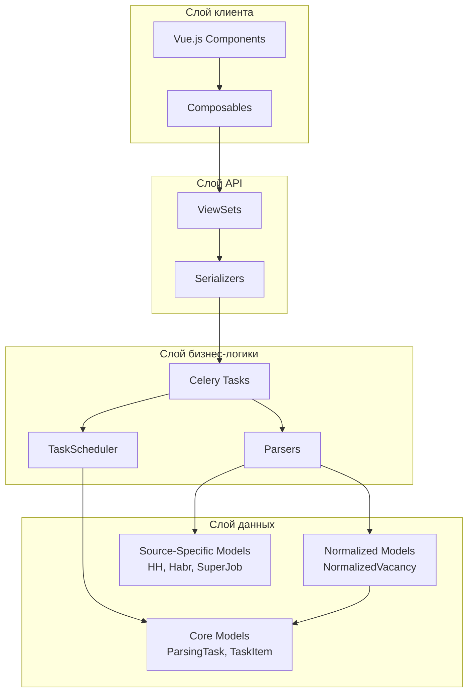
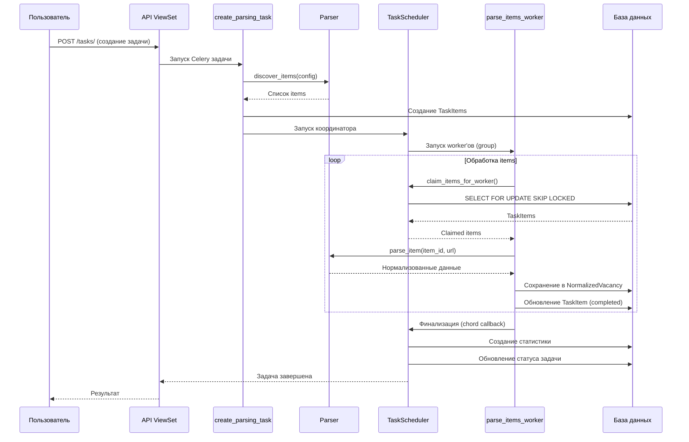

# Модуль парсинга вакансий (vacancies_parser)

## Введение

Модуль `vacancies_parser` предназначен для автоматизированного парсинга вакансий с различных площадок трудоустройства. Модуль обеспечивает масштабируемый, надежный и гибкий парсинг с поддержкой параллельной обработки, механизмов восстановления после сбоев и унификации данных в единый формат.

### Основные возможности

- ✅ Парсинг через **API** и **HTML** режимы
- ✅ Поддержка нескольких источников: **HeadHunter**, **Habr Career**, **SuperJob**
- ✅ Управление задачами: пауза, возобновление, остановка
- ✅ Нормализация данных в единый формат
- ✅ Дедупликация вакансий
- ✅ История изменений вакансий
- ✅ Параллельная обработка через Celery workers

---

## Архитектура модуля

### Общая структура

Модуль построен по принципу **многослойной архитектуры** с четким разделением ответственности:

```
modules/vacancies_parser/
├── api/                          # Backend (Django)
│   ├── core/                     # Ядро модуля
│   │   ├── models.py             # ParsingTask, TaskItem
│   │   ├── normalized_models.py  # NormalizedVacancy, VacancyChangeHistory, ParsingStatistics
│   │   ├── parsers/              # Парсеры
│   │   │   ├── base.py           # ParserInterface, BaseParser, ParserFactory
│   │   │   ├── api_parsers.py    # API парсеры
│   │   │   └── html_parsers.py   # HTML парсеры
│   │   ├── scheduler.py          # TaskScheduler (claiming, lease, crash recovery)
│   │   ├── tasks.py              # Celery задачи
│   │   ├── views.py              # API ViewSets
│   │   └── serializers.py        # DRF сериализаторы
│   ├── headhunter/               # HeadHunter-специфичный код
│   │   └── models.py             # Vacancy, VacancyVersion, VacancyChangeHistory
│   ├── habr_career/              # Habr Career-специфичный код
│   │   └── models.py             # Vacancy, VacancyVersion, VacancyChangeHistory
│   ├── superjob/                 # SuperJob-специфичный код
│   │   └── models.py             # SuperJobVacancy, SuperJobVacancyVersion, SuperJobVacancyChangeHistory
│   ├── celery_config.py          # Конфигурация Celery
│   └── celery_beat_config.py     # Конфигурация Celery Beat
└── client/                       # Frontend (Vue.js)
    ├── components/               # Vue компоненты
    └── composables/              # Vue composables
```

### Слои архитектуры



### Поток данных



### Ключевые компоненты

#### 1. Парсеры (`api/core/parsers/`)

**ParserInterface** - абстрактный интерфейс для всех парсеров:
- `discover_items(config)` - обнаружение элементов для парсинга
- `parse_item(item_id, url)` - парсинг одного элемента
- `validate_config(config)` - валидация конфигурации

**ParserFactory** - фабрика для создания парсеров по источнику и режиму:
- Поддерживает источники: `headhunter`, `habr_career`, `superjob`
- Поддерживает режимы: `api`, `html`

#### 2. TaskScheduler (`api/core/scheduler.py`)

**Механизм claiming** - конкурентно-безопасное распределение работы:
- Использует `SELECT FOR UPDATE SKIP LOCKED` для атомарного захвата items
- Каждый worker получает batch items для обработки
- Исключает конфликты при параллельной обработке

**Lease механизм** - защита от застревания задач:
- Каждый item получает `lease_expires_at` (по умолчанию 5 минут)
- Если worker упал, lease истекает и item становится доступным для другого worker'а
- Периодическая задача `release_expired_leases` освобождает застрявшие items

#### 3. Celery задачи (`api/core/tasks.py`)

**create_parsing_task** - создание задачи и discovery:
- Валидация конфигурации
- Проверка на дубликаты по `config_hash`
- Discovery фаза: получение списка items через парсер
- Создание TaskItems в БД
- Запуск координатора

**coordinate_parsing_task** - координация парсинга:
- Запускает группу worker'ов через `celery.group`
- Использует `celery.chord` для финализации после завершения всех worker'ов
- Отслеживает прогресс и обновляет статус задачи

**parse_items_worker** - обработка items:
- Claiming items через TaskScheduler
- Парсинг каждого item через парсер
- Сохранение в NormalizedVacancy
- Обновление статуса TaskItem

**finalize_parsing_task** - финализация:
- Создание статистики парсинга
- Обновление статуса задачи на `completed` или `failed`

---

## Модели данных

### Core Models (`api/core/models.py`)

#### ParsingTask

Модель для управления задачами парсинга с поддержкой state machine.

**Основные поля:**
- `source` - Источник (headhunter, habr_career, superjob)
- `parsing_mode` - Режим парсинга (api, html)
- `name` - Название задачи
- `config` - JSON конфигурация парсинга
- `config_hash` - SHA256 хэш конфигурации для дедупликации
- `status` - Статус задачи (state machine)
- `total_items` - Всего элементов для обработки
- `completed_items` - Завершено элементов
- `failed_items` - Элементов с ошибками
- `celery_task_id` - ID Celery задачи координатора

**State Machine:**
```
created → running → (paused | stopped | completed | failed)
         ↑    ↓
         └────┘ (resume)
```

**Методы:**
- `start()` - Запуск задачи (created → running)
- `pause()` - Приостановка (running → paused)
- `resume()` - Возобновление (paused → running)
- `stop()` - Остановка (running/paused → stopped)
- `complete()` - Завершение (running → completed)
- `fail(error_message)` - Ошибка (running → failed)

**Таблица:** `vpm_parsing_task`

**Уникальность:** `(source, config_hash)` - предотвращает создание дубликатов задач

#### TaskItem

Модель для атомарных единиц работы с lease механизмом для конкурентной обработки.

**Основные поля:**
- `task` - FK на ParsingTask
- `source_item_id` - ID элемента на источнике
- `url` - URL элемента
- `url_hash` - SHA256 хэш URL для дедупликации
- `status` - Статус элемента (state machine)
- `attempts_count` - Количество попыток
- `max_attempts` - Максимум попыток (default: 3)
- `last_error` - Последняя ошибка
- `last_error_type` - Тип ошибки (network, blocked, parsing, validation, unknown)
- `worker_id` - ID Celery worker'а
- `claimed_at` - Время захвата
- `lease_expires_at` - Истечение lease (для crash recovery)
- `result_vacancy_id` - ID созданной NormalizedVacancy
- `extracted_data` - JSON с извлеченными данными

**State Machine:**
```
pending → in_progress → (completed | failed | retrying | blocked)
   ↑           ↓
   └───────────┘ (release expired lease)
```

**Методы класса:**
- `claim_items_for_worker(worker_id, limit=10, lease_duration_minutes=5)` - Конкурентно-безопасное claiming через `SELECT FOR UPDATE SKIP LOCKED`
- `release_expired_leases()` - Освобождение застрявших items (crash recovery)

**Методы экземпляра:**
- `mark_completed(vacancy_id)` - Отметка как завершенного
- `mark_failed(error, error_type)` - Отметка как проваленного
- `mark_blocked()` - Отметка как заблокированного

**Таблица:** `vpm_task_item`

**Критические индексы:**
- `(task, status, lease_expires_at)` - Для claiming (критический!)
- `(status, lease_expires_at)` - Для crash recovery
- `(url_hash)` - Для дедупликации

### Normalized Models (`api/core/normalized_models.py`)

#### NormalizedVacancy

Унифицированная модель вакансии для всех источников. Содержит общие поля и специфичные данные в JSONField.

**Основные поля:**
- `source` - Источник (headhunter, habr_career, superjob)
- `source_id` - ID на источнике
- `source_url` - URL вакансии на источнике
- `parsing_mode` - Режим парсинга (api, html)
- `task_item` - FK на TaskItem (отслеживание источника парсинга)
- `title` - Название вакансии
- `company_name` - Название компании
- `description` - Описание вакансии
- `salary_from`, `salary_to`, `salary_currency`, `salary_gross` - Зарплата
- `area_name`, `area_id`, `address` - Локация
- `experience` - Требуемый опыт
- `employment_type`, `schedule` - Типы занятости и графики (ArrayField)
- `key_skills`, `professional_roles` - Навыки (ArrayField)
- `contacts` - JSON с контактами
- `is_active`, `archived` - Статусы вакансии
- `published_at` - Дата публикации на источнике
- `source_specific_data` - JSON с специфичными данными источника
- `raw_data` - JSON с сырыми данными для отладки
- `deduplication_hash` - SHA256 хэш для дедупликации (автоматически генерируется при сохранении)
- `original_vacancy_id` - FK на NormalizedVacancy, если это дубликат
- `deduplication_status` - Статус дедупликации (pending, original, duplicate)

**Методы:**
- `generate_deduplication_hash()` - Генерация хэша на основе ключевых полей (title, company_name, area_name, salary_from, salary_to)
- `update_deduplication_hash()` - Обновление хэша
- `get_salary_display()` - Форматированная зарплата для отображения
- `archive()` - Архивирование вакансии
- `activate()` - Активация вакансии

**Таблица:** `vpm_vacancy`

**Уникальность:** `(source, source_id)` - одна вакансия с одного источника

**Индексы:**
- `(source, is_active)`, `(source, archived)` - Поиск по источнику и статусу
- `(company_name, is_active)` - Поиск по компании
- `(area_name, is_active)` - Поиск по городу
- `(deduplication_hash)` - Для дедупликации
- Составные индексы: `(title, company_name)`, `(title, area_name)`, `(salary_from, salary_to)`

#### VacancyChangeHistory

История изменений нормализованной вакансии.

**Основные поля:**
- `vacancy` - FK на NormalizedVacancy
- `version` - Номер версии
- `task_item` - FK на TaskItem (отслеживание источника изменений)
- `changed_fields` - JSON с diff: `{field: {old: value, new: value}}`
- `changed_at` - Дата изменения
- `parsing_mode` - Режим парсинга

**Таблица:** `vpm_vacancy_change_history`

**Уникальность:** `(vacancy, version)`

#### ParsingStatistics

Статистика парсинга для мониторинга и аналитики.

**Основные поля:**
- `task` - FK на ParsingTask
- `started_at`, `finished_at`, `duration_seconds` - Временные метрики
- `total_processed`, `successful_items`, `failed_items`, `blocked_items` - Счетчики
- `avg_item_duration_ms`, `items_per_second` - Производительность
- `complete_records`, `incomplete_records` - Качество данных
- `error_breakdown` - JSON с разбивкой ошибок по типам

**Методы:**
- `calculate_metrics()` - Расчет производственных метрик

**Таблица:** `vpm_parsing_statistics`

### Source-Specific Models

Модели для хранения **сырых данных** от источников. Используются для:
- Сохранения оригинальных данных в неизменном виде
- Отладки и reprocessing
- Версионирования (отслеживание изменений вакансий на источнике)

**Система именования таблиц:**

Все таблицы модуля используют префикс `vpm_` (Vacancy Parser Module) для единообразия и избежания конфликтов:

- **Основные таблицы:** `vpm_parsing_task`, `vpm_task_item`, `vpm_vacancy`, `vpm_vacancy_change_history`, `vpm_parsing_statistics`
- **HeadHunter:** `vpm_hh_vacancy`, `vpm_hh_vacancy_version`, `vpm_hh_vacancy_change_history`
- **Habr Career:** `vpm_hc_vacancy`, `vpm_hc_vacancy_version`, `vpm_hc_vacancy_change_history`
- **SuperJob:** `vpm_sj_vacancy`, `vpm_sj_vacancy_version`, `vpm_sj_vacancy_change_history`

#### HeadHunter (`api/headhunter/models.py`)

- **Vacancy** (`vpm_hh_vacancy`) - Сырые данные вакансий HeadHunter
- **VacancyVersion** (`vpm_hh_vacancy_version`) - Метаданные версий
- **VacancyChangeHistory** (`vpm_hh_vacancy_change_history`) - История изменений полей

#### Habr Career (`api/habr_career/models.py`)

- **Vacancy** (`vpm_hc_vacancy`) - Сырые данные вакансий Habr Career
- **VacancyVersion** (`vpm_hc_vacancy_version`) - Метаданные версий
- **VacancyChangeHistory** (`vpm_hc_vacancy_change_history`) - История изменений полей

#### SuperJob (`api/superjob/models.py`)

- **SuperJobVacancy** (`vpm_sj_vacancy`) - Сырые данные вакансий SuperJob
- **SuperJobVacancyVersion** (`vpm_sj_vacancy_version`) - Метаданные версий
- **SuperJobVacancyChangeHistory** (`vpm_sj_vacancy_change_history`) - История изменений полей

---

## Как это работает

### Жизненный цикл задачи парсинга

#### 1. Создание задачи

Пользователь создает задачу через API, указывая:
- Источник (headhunter, habr_career, superjob)
- Режим парсинга (api, html)
- Конфигурацию (параметры поиска, фильтры и т.д.)

**Процесс:**
1. Валидация входных данных
2. Проверка на дубликаты по `config_hash` (задачи с одинаковой конфигурацией не создаются повторно)
3. Создание `ParsingTask` со статусом `created`
4. Создание парсера через `ParserFactory.create_parser(source, parsing_mode)`
5. Валидация конфигурации через `parser.validate_config(config)`
6. **Discovery фаза:** `parser.discover_items(config)` - получение списка items (URL вакансий)
7. Создание `TaskItems` через `bulk_create()` (статус `pending`)
8. Обновление `total_items` в `ParsingTask`
9. Запуск задачи: `task.start()` (created → running)
10. Запуск координатора: `coordinate_parsing_task.apply_async()`

#### 2. Координация парсинга

Координатор (`coordinate_parsing_task`) управляет параллельной обработкой:

1. Запускает группу worker'ов через `celery.group` (по умолчанию 10 worker'ов)
2. Каждый worker обрабатывает batch items параллельно
3. Использует `celery.chord` для финализации после завершения всех worker'ов

**Параллелизм:**
- Worker'ы работают независимо друг от друга
- Каждый worker обрабатывает свой batch items
- Нет конфликтов благодаря механизму claiming

#### 3. Обработка items (Worker)

Каждый worker выполняет следующий цикл:

1. **Claiming:** `TaskScheduler.claim_items_for_worker()` - атомарный захват batch items
   - Использует `SELECT FOR UPDATE SKIP LOCKED` для конкурентной безопасности
   - Устанавливает `lease_expires_at` (защита от застревания)
   - Обновляет статус на `in_progress`

2. **Парсинг:** Для каждого item:
   - Вызов `parser.parse_item(item_id, url)`
   - Парсер извлекает данные с источника
   - Нормализация данных в формат `NormalizedVacancy`

3. **Сохранение:**
   - Создание/обновление `NormalizedVacancy` в БД
   - Сохранение сырых данных в source-specific модель (если нужно)
   - Обновление `TaskItem` на `completed` или `failed`

4. **Повтор:** Если есть еще items, возврат к шагу 1

**Обработка ошибок:**
- При ошибке парсинга: `TaskItem.mark_failed(error, error_type)`
- При блокировке (captcha, rate limit): `TaskItem.mark_blocked()`
- При сетевой ошибке: повторная попытка (до `max_attempts`)

#### 4. Финализация

После завершения всех worker'ов вызывается `finalize_parsing_task`:

1. Создание `ParsingStatistics` с метриками:
   - Временные метрики (длительность, скорость)
   - Счетчики (успешные, проваленные, заблокированные)
   - Разбивка ошибок по типам

2. Обновление статуса `ParsingTask`:
   - `completed` - если все items обработаны
   - `failed` - если критическая ошибка

3. Уведомление пользователя о завершении

### Механизм Claiming и Lease

**Проблема:** При параллельной обработке несколько worker'ов могут попытаться обработать один и тот же item.

**Решение:** Механизм claiming с использованием `SELECT FOR UPDATE SKIP LOCKED`:

```python
# Атомарный захват items
items = TaskItem.objects.filter(
    task=task,
    status='pending',
    lease_expires_at__lt=now()
).select_for_update(skip_locked=True)[:limit]

# Установка lease
for item in items:
    item.status = 'in_progress'
    item.worker_id = worker_id
    item.claimed_at = now()
    item.lease_expires_at = now() + timedelta(minutes=5)
    item.save()
```

**Преимущества:**
- Атомарность: только один worker может захватить item
- `SKIP LOCKED`: другие worker'ы не блокируются, а переходят к следующим items
- Lease: защита от застревания при падении worker'а

**Crash Recovery:**

Периодическая задача `release_expired_leases` (запускается каждую минуту через Celery Beat):
- Находит items с истекшим lease (`lease_expires_at < now()`)
- Возвращает их в статус `pending`
- Позволяет другим worker'ам обработать их

### Нормализация данных

**Проблема:** Разные источники имеют разные форматы данных.

**Решение:** Унифицированная модель `NormalizedVacancy`:

1. **Общие поля:** Все источники имеют общие поля (title, company_name, salary, location и т.д.)
2. **Специфичные данные:** Уникальные поля источников хранятся в `source_specific_data` (JSONField)
3. **Сырые данные:** Оригинальные данные сохраняются в source-specific моделях для отладки

**Процесс нормализации:**

```python
# Парсер извлекает данные
raw_data = parser.parse_item(item_id, url)

# Нормализация в унифицированный формат
normalized = NormalizedVacancy(
    source='headhunter',
    source_id=raw_data['id'],
    title=raw_data['name'],
    company_name=raw_data['employer']['name'],
    salary_from=raw_data['salary']['from'],
    # ... другие поля
    source_specific_data={
        'professional_roles': raw_data.get('professional_roles'),
        # ... специфичные данные
    },
    raw_data=raw_data  # Для отладки
)
```

### Дедупликация

**Проблема:** Одна и та же вакансия может быть найдена несколько раз (разные источники, разные запросы).

**Решение:** Механизм дедупликации на основе хэша ключевых полей:

1. **Генерация хэша:** При сохранении `NormalizedVacancy` автоматически генерируется `deduplication_hash`:
   ```python
   hash_fields = [
       self.title,
       self.company_name,
       self.area_name,
       str(self.salary_from),
       str(self.salary_to)
   ]
   deduplication_hash = hashlib.sha256('|'.join(hash_fields).encode()).hexdigest()
   ```

2. **Поиск дубликатов:** При создании новой вакансии проверяется наличие вакансии с таким же хэшем

3. **Обработка дубликатов:**
   - Если дубликат найден: новая вакансия помечается как `duplicate`, ссылается на `original_vacancy_id`
   - Если дубликат не найден: вакансия помечается как `original`

### Управление задачами

**State Machine для ParsingTask:**

```
created → running → (paused | stopped | completed | failed)
         ↑    ↓
         └────┘ (resume)
```

**Операции:**
- **start()** - Запуск задачи (created → running)
- **pause()** - Приостановка (running → paused). Worker'ы продолжают обрабатывать текущие items, но не берут новые
- **resume()** - Возобновление (paused → running)
- **stop()** - Остановка (running/paused → stopped). Прерывает все worker'ы
- **complete()** - Завершение (running → completed)
- **fail()** - Ошибка (running → failed)

**Отслеживание прогресса:**

Прогресс задачи отслеживается через счетчики:
- `total_items` - Всего items для обработки
- `completed_items` - Завершено items
- `failed_items` - Провалено items

Прогресс в процентах: `(completed_items + failed_items) / total_items * 100`

---

## Дополнительные материалы

- [DOCUMENTATION.md](DOCUMENTATION.md) — описание модуля, алгоритм парсинга, нормализованный вид и схемы процессов
- [MODELS_DOCUMENTATION.md](MODELS_DOCUMENTATION.md) - Детальная документация по моделям данных

---

**Версия документации:** 3.0  
**Дата обновления:** 19.01.2026
